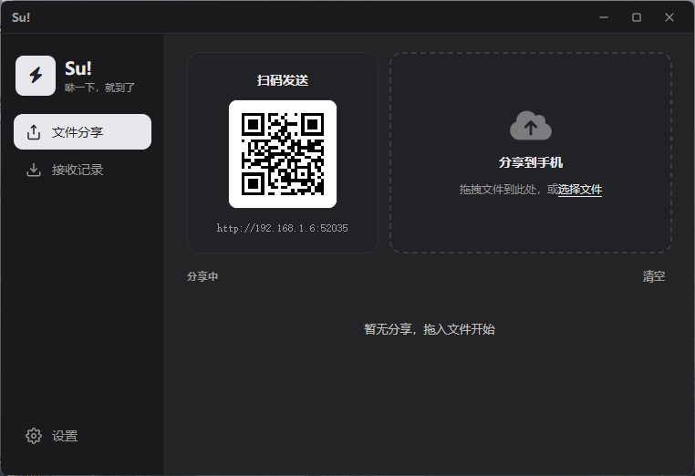

<p align="center"></p>

<h1 align="center">Su! — LAN File Transfer</h1>
<p align="center"><em>咻一下，就到了！ Whoosh, it's there!</em></p>

<p align="center">
  
</p>

<p align="center">
  <a href="https://github.com/Hunter-Lies/Su/releases"></a>
  <a href="LICENSE"></a>
  <a href="README_zh.md">中文</a>
</p>

---

A lightweight LAN file transfer tool. **No cloud, no login, no app install** — scan a QR code and transfer files between your phone and PC in seconds.

## Features

- **QR Share** — Right-click any file, generate a QR code, phone scans to download
- **Phone → PC** — Send files from your phone browser over LAN
- **Batch Download** — Select all, single, or batch with clear file list
- **5 Languages** — 简体中文 · 繁體中文 · English · 日本語 · 한국어
- **Dark Mode** — Classic & frosted glass themes, auto system follow
- **Smart Batching** — Auto device detection (iPhone / Android / Windows / Mac / Linux), group by batch
- **Sound + Popup** — Audio alerts and card notifications on receive
- **System Tray** — Minimize to tray, auto-start with system
- **Range Download** — Resumable chunked downloads for large files

## Quick Start

1. Download the [latest Release](https://github.com/Hunter-Lies/Su/releases)
2. Run `Su-v1.2.0-windows-x64.exe` (or the x86 version)
3. Drag files to the window → phone scans QR to download
4. Phone scans QR → select files to send to PC

## Tech Stack

| Layer | Stack |
|-------|-------|
| Desktop App | [Tauri v2](https://tauri.app/) + Rust |
| UI | Vanilla JS (ES Modules) + CSS Custom Properties |
| Mobile Pages | Plain HTML/JS/CSS, served by embedded HTTP server |
| HTTP Server | [tiny_http](https://github.com/tiny-http/tiny-http) |
| QR Code | [qrcode](https://crates.io/crates/qrcode) |
| Audio | [rodio](https://github.com/RustAudio/rodio) + [symphonia](https://github.com/pdeljanov/Symphonia) |

## Build

**Prerequisites**

| Tool | Version |
|------|---------|
| [Node.js](https://nodejs.org/) | >= 18 |
| [Rust](https://rustup.rs/) | >= 1.70 |
| WebView2 | Built-in on Windows 10/11 |

```bash
npm install
npm run tauri dev                    # Development
npm run tauri build                  # Release (x64)
npm run tauri build -- --target i686-pc-windows-msvc  # Release (x86)
```

Output in `src-tauri/target/`.

## Project Structure

```
Su/
├── src/                      # Desktop Frontend
│   ├── index.html
│   ├── js/                   # main.js, i18n.js, theme.js, ...
│   ├── css/styles.css
│   └── assets/fonts/         # Font Awesome (local)
├── src-tauri/                # Rust Backend
│   ├── src/                  # Rust source
│   ├── web/                  # Mobile pages
│   ├── sounds/               # Audio files
│   └── icons/                # App icons
├── package.json
└── README.md
```

## Contributors

[](https://github.com/Hunter-Lies/Su/graphs/contributors)

## License

MIT — see [LICENSE](LICENSE)

## Author

**HunterLies** · [Bilibili](https://space.bilibili.com/488494586) · [Website](https://htovo.com)
